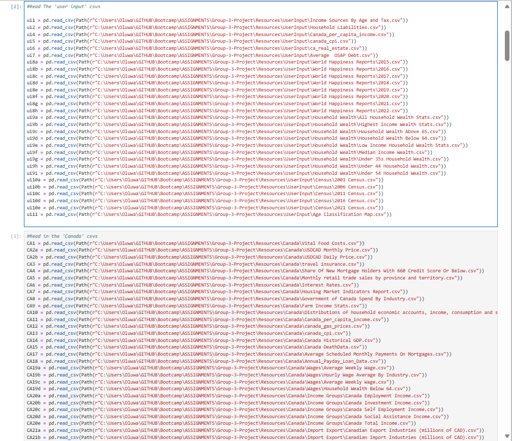
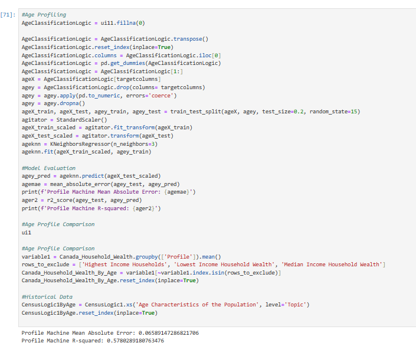
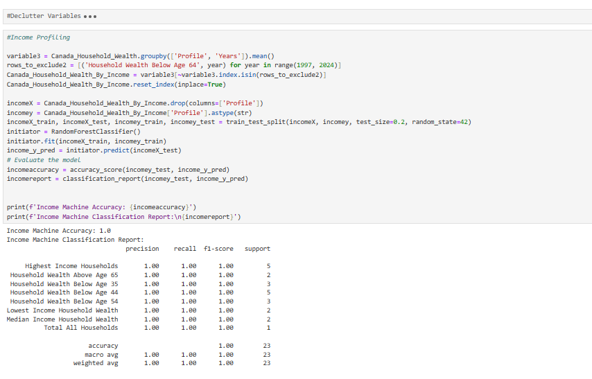
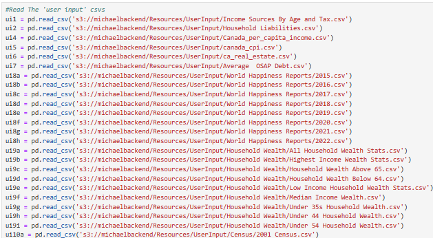

# Merlin - The Financial RoboAdvisor
##### Created by **Demi Oyebanji**, **Anna Toaze**, **Daniel Froom**, and **Suleiman Abdul Samad** as a project for the **UofT SCS Financial Technology Bootcamp**

_________________________________________________________________________________________________________________________________________________________________________________________________________

If you're inspired by our code please find a way to credit us by name :)
If you'd like to hire our team or use this for research/ commercial purposes, please reach out by email.

**CLICK NAME BELOW TO EMAIL**:
[Demi Oyebanji](mailto:oluwademiladeoyebanji@outlook.com),
[Daniel Froom](mailto:danifroom@gmail.com),
[Anna Toaze](mailto:anna.tz@live.com),
[Suleiman Abdul Samad](mailto:issakdanlity@gmail.com),

_____________________________________________________________________________________________________

The files in this project run on the AWS System with the following programs:
* Amazon Lex
* Amazon Lambda
* Amazon S3
* Amazon SageMaker
* Amazon DynamoDB

## Amazon Lex

[Merlin-DRAFT](Merlin-DRAFT-16SXMQ5ZXR-LexJson.zip) is our LexBot file. In Amazon Lex, we generated a bot that speaks to users and collects info about their finances in order to assist them better. User can answer in a natural way and the bot can derive figures, approximates, labels and more and place them into a table format. The bot tries to fill out as much of this information as possible:
* Contact Information
* Country of Residence
* Location(City)
* Province/ State
* Name
* Age
* Household Size
* Housing type
* Occupation
* Income/ Income Source
* Net Liabilities
* Net Assets
* Private Medical Expenses
* Transportation Spend
* Charitable Contributions
* Essential Food Spend
* Non-essential Food Spend
* Clothing Spend
* Credit Card Debt
* Credit Score
* Debt Service
* Education Spend
* Vacation/ Travel Spend
* Wellness Spend

## Amazon Lambda

After the Lex bot collects all the information we need to store the information for each user in a place where we can retrieve it. Our [Lambda Function](lextodb.py) connects the Lex output to DynamoDB which is an AWS-based database where we could store all user data. Once the data is accessible in Dynamo DB the magic can begin

## Amazon Sagemaker

Amazon Sagemaker allowed us to host complex Python logic on AWS which was perfect because we trained an AI to make financial predictions for a user based on lots and lots of data that we found available on [Kaggle](https://www.kaggle.com), [Canadian Government Public Data](https://search.open.canada.ca/opendata/), and more.  It includes data like:
* World Happiness Reports
* Average OSAP Debt
* USDCAD Monthly/Daily Price
* Disribution of Household Income
* Census Data
* Canadian Cost Per Index Data
* Canadaian and American Government Spend Data
* Historical Wage Data
* and lots, lots more

  ......it's a lot of CSVs
**User input and Canadian Data CSVs**

After cleaning and preprocessing the data, we use complex machine learning models to run predictions and build clusters based on different financial patterns that overlap between datasets. 

**Age Profiler** - 0.06 Mean Error on clustering people by age based on inputs such as income, debt, assets and more. It could form clusters such as '65+', '21-35', etc.

**Income Profiler** - 100% Cluster Accuracy based on inputs such as age, debt, assets, trave spending and more

#### Quick Note: S3
In order to maintain our Notebook on Sagemaker which has all the logic, we need to keep all our CSV files on S3 so the notebook can access them. 

## Future Considerations

We would have loved more time to finish the relationship between all bots but since this was a two week project we couldn't quite polish it off. 

Some things we would have loved to implement:

* We expected to feed the analysis results back into Amazon Lex using another Lambda function so that the bot could give the user results
* We also wanted to extend the "conversational" feel of the bot so it feels less scripted
* The SageMaker also had an extensive timeseries logic that we would have loved to integrate with more time

